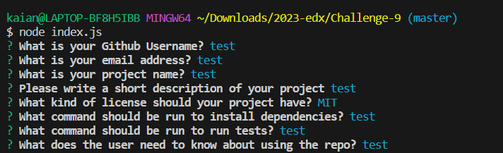

# Challenge-9( node.js)

## Description
 Code that allows for quick and professional README.

## Table of Contents
- [Installation](#installation)
- [Usage](#usage)
- [License](#license)
- [Contributing](#contributing)
- [Tests](#tests)
- [Questions](#questions)

## Installation
npm install , (when completed and finished run node index.js) 
use in command line 

## Usage
allows for quick and easy Readme

## License
This project is licensed under the MIT license.

## Question
If you have any questions contact me directly at kaianmui@gmail.com. You can find more of my work at [Muisagara]

## Screenshots
